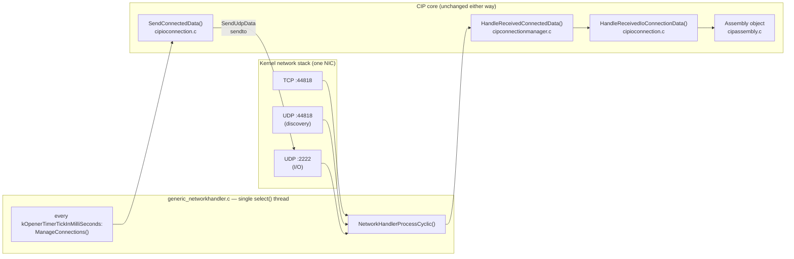
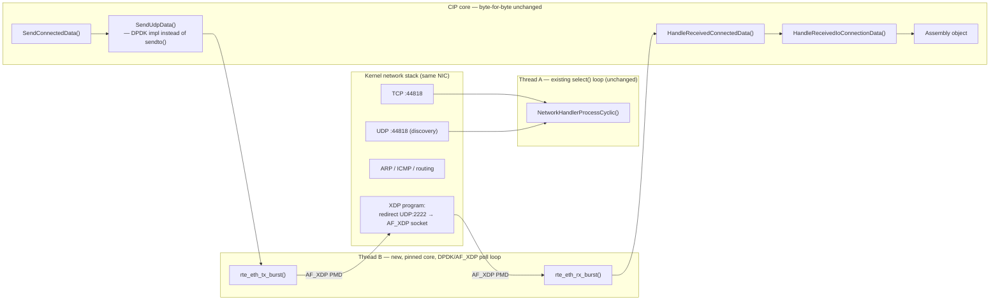
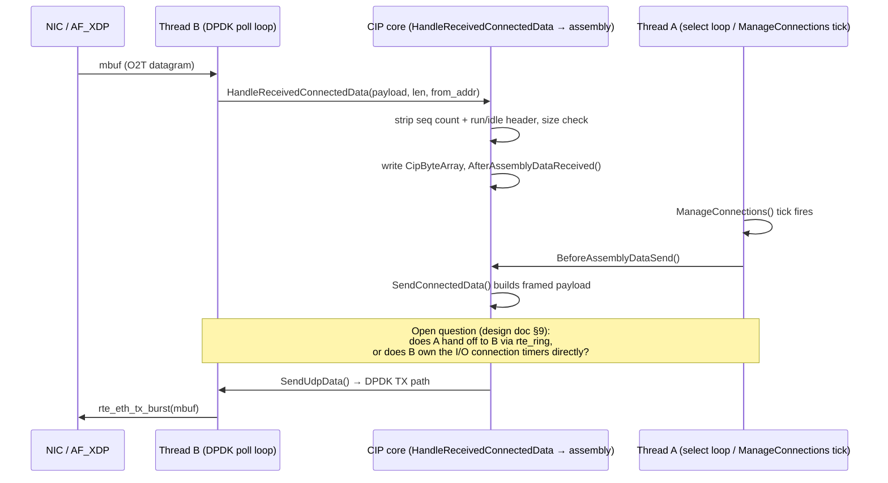

# DPDK I/O Datapath — Overview

This folder is the entry point for the proposal to accelerate OpENer's
cyclic Class 0/1 I/O messaging with DPDK. It exists to hold diagrams; the
written rationale and open questions live in the two root-level documents
this links to.

- **Full design & rationale:** [`../../DPDK_IO_DATAPATH_DESIGN.md`](../../DPDK_IO_DATAPATH_DESIGN.md)
- **Interop test findings this builds on:** [`../../EIPSCANNER_TESTING.md`](../../EIPSCANNER_TESTING.md)
- Status: **proposal, not yet implemented**

## Current architecture

Everything — TCP explicit messaging, UDP discovery, and UDP Class 0/1 I/O —
goes through one `select()` loop on one thread.

## Proposed hybrid architecture (Option B: shared NIC via AF_XDP)

Only the UDP :2222 path moves. TCP explicit messaging and discovery are
untouched — same thread, same code, same kernel sockets. The two
functions already transport-agnostic today (verified in the design doc)
become the seam where a DPDK/AF_XDP backend plugs in.

## RX/TX sequence (per §5 of the design doc)

## Reading order

1. [`../../EIPSCANNER_TESTING.md`](../../EIPSCANNER_TESTING.md) — why this
   matters: the interop testing that exercised the exact I/O datapath
   these diagrams show, and the same-host UDP port collision it
   surfaced (relevant to how any DPDK version gets tested too).
2. [`../../DPDK_IO_DATAPATH_DESIGN.md`](../../DPDK_IO_DATAPATH_DESIGN.md) —
   full write-up: goals/non-goals, Option A vs B tradeoffs, the exact
   seam functions with file/line references, threading model, build
   integration, and open questions.
3. This file — the diagrams, kept separate so the design doc stays
   readable as text and these can be updated independently as the design
   evolves.
